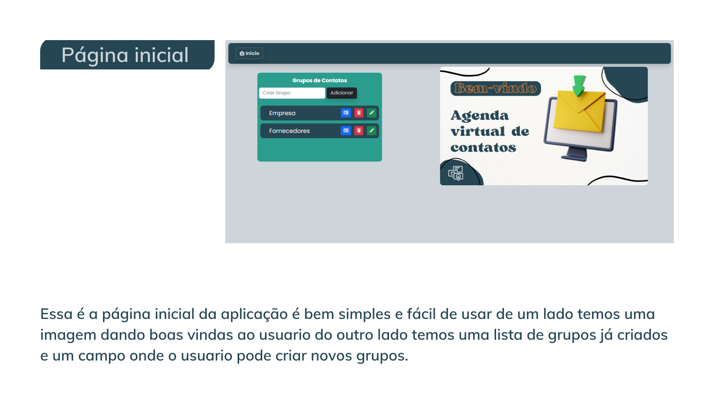
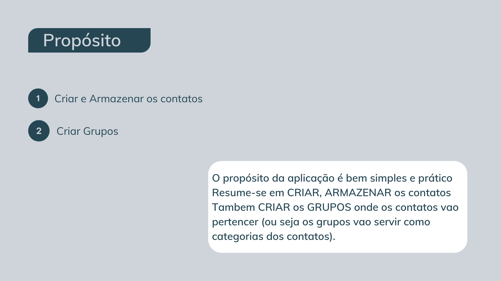
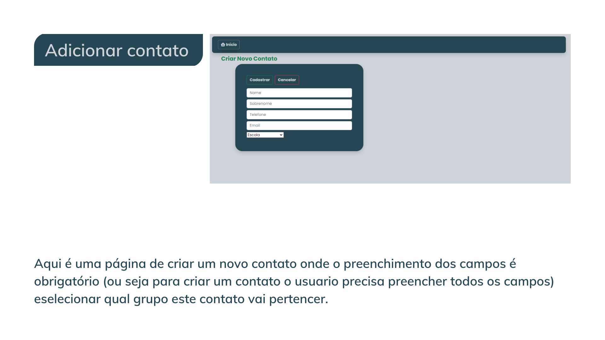
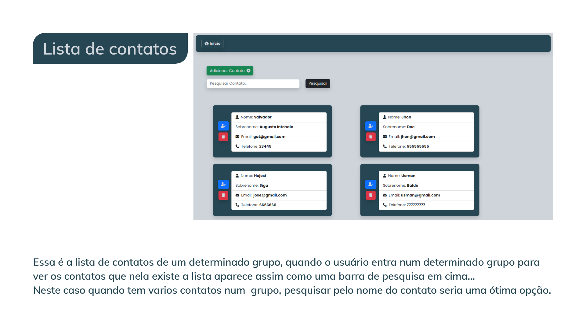
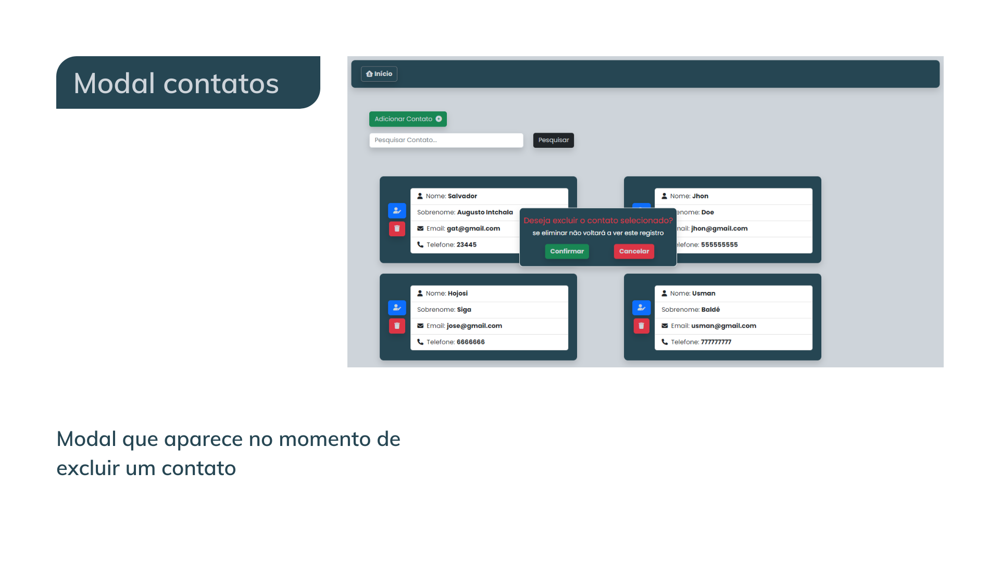
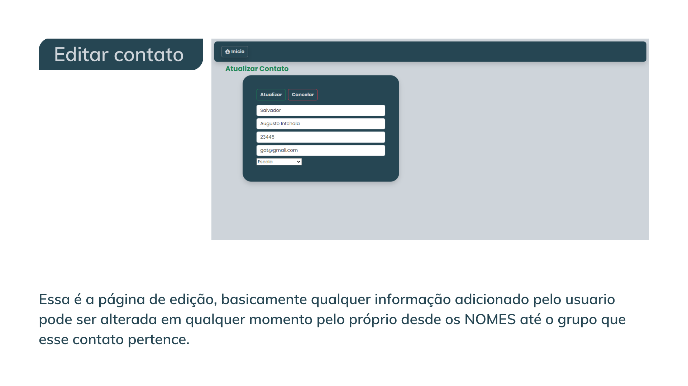
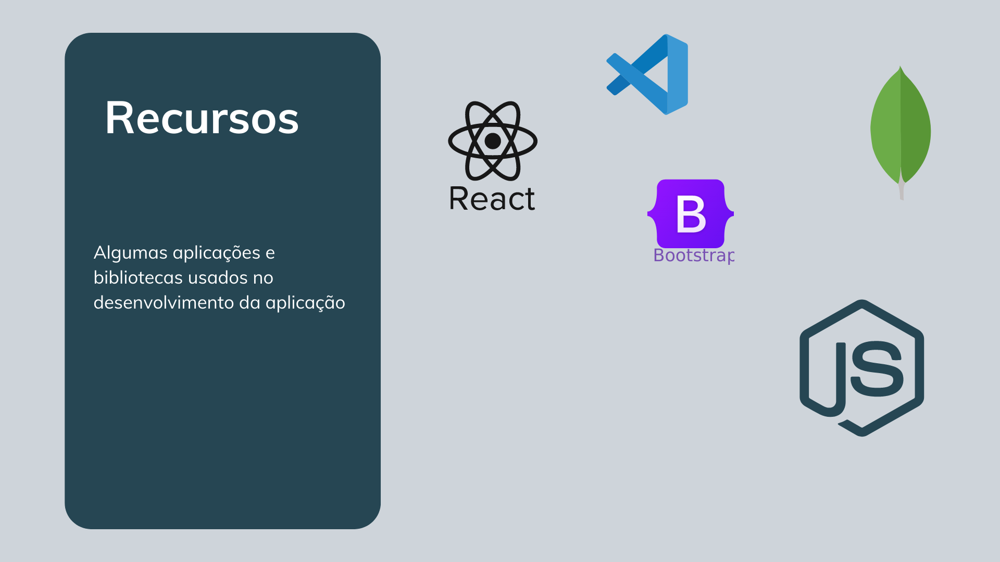
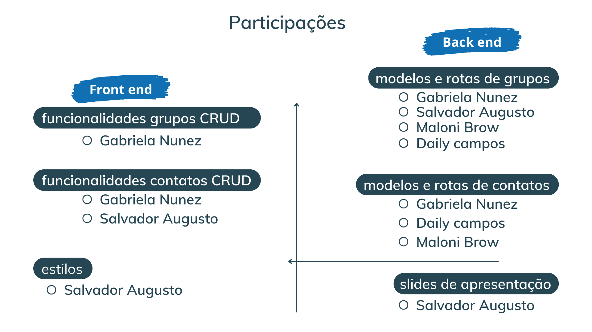

PROJETO EM GRUPO COMO TAREFA FINAL DO CURSO EM PROGRAMAÇÃO FULL STACK NA [TOTI](https://totidiversidade.com.br/)
---
EQUIPE
* Gabriela Nunez
* Daily campos
* Maloni Brow
* Salvador Augusto Intchala
---

PÁGINA INICIAL DA APLICAÇÃO

---

PROPÓSITO DA APLICAÇÃO

---

ADICIONAR UM CONTATO

---

LISTA DE CONTATOS

---

MODAL

---

EDITAR

---

RECURSOS

---

PARTICIPAÇÕES

